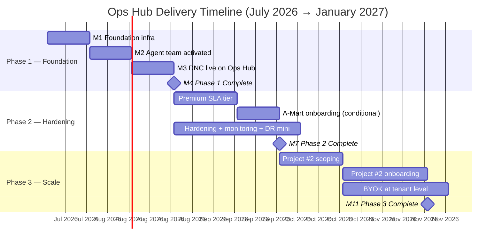

# 09 — Delivery

> The practical roadmap. Three phases, milestones with target dates, KPIs to track, and the critical path showing what blocks what.

---

## Phasing overview

| Phase | Goal | Duration | Target window |
|---|---|---|---|
| **Phase 1 — Foundation** | Get the hub running for TTS with the core agent team and basic ticket flow. Prove the model. | 4–6 weeks | July → early September 2026 |
| **Phase 2 — Hardening** | Production-grade reliability, full agent team active, Premium SLA tier launched. | 6–8 weeks | September → late October 2026 |
| **Phase 3 — Scale (multi-project)** | Onboard Project #2. Prove app-agnosticism. Enable tenant BYOK. | 8–12 weeks | November 2026 → January 2027 |

Phases overlap. Phase 2 hardening starts as soon as Phase 1 MVP is stable, not after a hard cutover. Phase 3 is gated on Phase 2 sustaining itself without founder firefighting.

---

## Phase 1 — Foundation

### Success criteria

The hub is in Phase 1 complete state when **all** of these are true:

- [ ] GitHub repo `admin-nutshell/ops-hub` exists with full plan + workspace files
- [ ] Coolify projects provisioned: `ops-hub-staging` and `ops-hub-prod` on VPS
- [ ] Dedicated Supabase project for Ops Hub (pgvector enabled)
- [ ] Inngest, LangFuse, LiteLLM running in both staging and prod
- [ ] All 11 agent specs loaded; agents respond when invoked in Claude Code
- [ ] FreeScout deployed and connected as ticket intake
- [ ] CI/CD pipeline active: lint, tests, eval gate, staging auto-deploy, prod manual promotion
- [ ] At least 1 eval case per agent; eval gate enforced on PRs
- [ ] Sentry + UptimeRobot wired for both Ops Hub and TTS
- [ ] At least 1 ticket has flowed end-to-end from FreeScout → triage → fix → deploy → resolved
- [ ] First synthetic incident drill completed; first post-mortem authored
- [ ] DNC (Daily Needs Canada) tickets flowing through Ops Hub
- [ ] First monthly founder briefing produced

### What's scoped IN for Phase 1

- Single-project (TTS) ticket flow
- Basic ticket lifecycle (states `new` through `closed`; `won't_fix` and `duplicate` supported)
- Standard SLA tier only (no Premium yet)
- Inngest free tier
- LangFuse free tier
- Manual triage augmented by Production Manager agent
- Founder reviews FOUNDER_QUEUE.md 1–2x/day
- Static status page on `status.inatechshell.ca` (manually updated for v1)

### What's scoped OUT of Phase 1 (deferred)

- Premium SLA tier
- Cstate-driven automatic status updates
- BYOK at tenant level (still platform-level keys)
- Project Context schema as a refactored module (it's hardcoded-ish for TTS in v1)
- Annual DR drill (first one in Phase 2)
- Solutions Architect onboarding playbook (drafted but not exercised until Project #2)
- Monthly investor email automation (founder writes manually)

---

## Phase 2 — Hardening

### Success criteria

- [ ] All Phase 1 capabilities sustaining themselves with < 5 founder interventions/week
- [ ] All 14 ticket lifecycle states exercised at least once
- [ ] Premium SLA tier configured and one tenant on it (target: A-Mart YYC if pilot converts)
- [ ] Cstate status page live with automatic updates from monitoring signals
- [ ] Backup verification automated, monthly run logged
- [ ] First quarterly mini DR drill completed
- [ ] Full eval coverage: ≥ 5 cases per agent
- [ ] Risk register reviewed monthly, with documented outcomes
- [ ] Weekly retro + monthly briefing producing consistently
- [ ] At least 1 month of SLA adherence reporting per severity tier
- [ ] Security Lead reviewing all PRs touching tenant data
- [ ] First post-mortem from a real (non-drill) incident, with follow-through complete
- [ ] First investor monthly email sent with platform metrics

### What's scoped IN for Phase 2

- Premium SLA tier ($200 CAD/mo add-on)
- Automated status page updates
- Full RACI in practice across all 11 agents
- Monthly briefings + investor emails on cadence
- A-Mart YYC onboarded (conditional on pilot conversion)
- Backup verification runbooks executing on cadence
- Secrets rotation cadence active
- First mini DR drill (component-level, not full VPS rebuild)

### What's scoped OUT of Phase 2

- Project #2 (Phase 3)
- BYOK at tenant level (Phase 3)
- SOC 2 certification work (gated on enterprise demand)
- Full VPS rebuild drill (annual, runs once Phase 3 stable)

---

## Phase 3 — Scale (multi-project)

### Success criteria

- [ ] Project #2 identified and onboarded via Solutions Architect playbook
- [ ] Project #2 onboarding took < 1 week of founder time
- [ ] Project Context schema proven generalizable (no TTS-specific hardcoding)
- [ ] Multi-project cost reporting operational (per-project COGS)
- [ ] BYOK at tenant level implemented (tenants supply own LLM API keys)
- [ ] At least one enterprise-class tenant interested in BYOK validated
- [ ] First full DR drill completed (VPS-level)
- [ ] SOC 2 gap assessment authored (no certification yet)
- [ ] Free-tier headroom holding (< 70% utilized across all tools at peak)
- [ ] Founder time on operations < 10 hours/week (sustainably)

### What's scoped IN for Phase 3

- Onboard a second project on the hub
- BYOK at tenant level (Module B extended)
- Per-project P&L reporting
- Per-project dashboards
- SOC 2 gap assessment
- Full annual DR drill
- Solutions Architect playbook validated by use

### What's scoped OUT of Phase 3

- SOC 2 certification (deferred until enterprise demand makes it ROI-positive)
- Project #3 (if it happens, it's Phase 4 / Year 2)
- New geography expansion
- New regulatory regime adoption

---

## Milestones with target dates

| # | Milestone | Phase | Target | Owner |
|---|---|---|---|---|
| M1 | Workspace + Foundation | P1 | End July 2026 (Wk 1–2) | Founder + Tech Lead |
| M2 | Agent Team Activated | P1 | Mid August 2026 (Wk 3–4) | PM + Tech Lead |
| M3 | TTS Tenant #1 (DNC) live on Ops Hub | P1 | End August 2026 (Wk 5–6) | Solutions Architect + PM |
| M4 | **Phase 1 Complete** | P1 → P2 | Early September 2026 (Wk 6–7) | PM + Founder |
| M5 | Premium SLA tier launched | P2 | Late September 2026 (Wk 9–10) | Production Manager + Solutions Architect |
| M6 | A-Mart YYC onboarded (conditional) | P2 | Early October 2026 (Wk 11–12) | Solutions Architect + Founder |
| M7 | **Phase 2 Complete** | P2 → P3 | Late October 2026 (Wk 14) | PM + Founder |
| M8 | Project #2 identified + scoped | P3 | Mid November 2026 (Wk 18) | Founder + Solutions Architect |
| M9 | Project #2 onboarded | P3 | Mid December 2026 (Wk 22) | Solutions Architect + Tech Lead |
| M10 | BYOK at tenant level shipped | P3 | Late December 2026 (Wk 24) | Tech Lead + Security Lead |
| M11 | **Phase 3 Complete** | P3 | Mid January 2027 (Wk 26) | PM + Founder |

### Visual timeline



---

## KPIs per phase

### Phase 1 KPIs

| KPI | Target | Measured by |
|---|---|---|
| Agent response time (when invoked) | < 30 sec p95 | Inngest dashboard |
| Time-to-first-response (P1 tickets) | < 5 min | Production Manager weekly report |
| Time-to-first-response (P2) | < 15 min | Production Manager weekly report |
| Time-to-first-response (P3) | < 1 hour | Production Manager weekly report |
| Eval pass rate | > 95% | LangFuse |
| Founder approval queue clearance | < 24 hours | FOUNDER_QUEUE.md audit |
| LLM cost per ticket | < $1 USD | LiteLLM cost log |
| Workflow run success rate | > 95% | Inngest |
| End-to-end tickets resolved | ≥ 5 by M4 | FreeScout |

### Phase 2 KPIs

All Phase 1 KPIs maintained, **plus:**

| KPI | Target | Measured by |
|---|---|---|
| SLA adherence (P1) | ≥ 99% | Monthly Production Manager report |
| SLA adherence (P2) | ≥ 95% | Monthly Production Manager report |
| SLA adherence (P3) | ≥ 95% | Monthly Production Manager report |
| Hotfix rate | < 4 / quarter | DECISIONS.md scan |
| Post-mortem completion within 7 days | 100% | Tech Lead audit |
| Tenant satisfaction (post-resolution thumbs / brief survey) | ≥ 80% positive | FreeScout |
| Backup verification on cadence | 100% | `docs/governance/backup-verification.md` |
| Founder time on operations | < 15 hours/week | Founder self-report |
| Premium SLA tenants | ≥ 1 by M7 | CRM / billing |

### Phase 3 KPIs

All Phase 2 KPIs maintained, **plus:**

| KPI | Target | Measured by |
|---|---|---|
| New project onboarding time | < 1 week of founder time | Solutions Architect playbook log |
| New tenant onboarding time | < 1 day | Solutions Architect playbook log |
| Per-project COGS visibility | 100% allocated | Data Engineer monthly report |
| Free-tier headroom (across all tools) | < 70% utilized at peak | Data Engineer monthly report |
| Founder time on operations | < 10 hours/week | Founder self-report |
| Multi-project tickets handled correctly | > 99% routed to correct project | Audit log |
| BYOK adoption | ≥ 1 tenant on own LLM keys | Vault audit |

---

## Critical path

### Phase 1 critical path

```
GitHub repo created
       ↓
Coolify projects provisioned (staging + prod)
       ↓
Supabase project for Ops Hub created
       ↓
Inngest + LangFuse + LiteLLM running
       ↓
Agent specs loaded into Claude Code
       ↓
Workspace files initialized (WORK.md / DECISIONS.md / FOUNDER_QUEUE.md)
       ↓
CI/CD pipeline + eval gate active
       ↓
FreeScout connected as ticket intake
       ↓
First end-to-end ticket flowed through
       ↓
DNC tickets routed to Ops Hub
       ↓
[M4: PHASE 1 COMPLETE]
```

Each step blocks the next. Any delay cascades. Founder + Tech Lead pair through the first few steps; agents take over progressively.

### Phase 2 critical path

```
[M4: Phase 1 stable]
       ↓
Cstate status page deployed
       ↓
Premium SLA tier configured in billing + monitoring
       ↓                             ↓
Backup verification automation     A-Mart pilot conversation (parallel, exogenous)
       ↓                             ↓
Mini DR drill scheduled               If converts → A-Mart onboarded on Premium
       ↓                             ↓
First quarterly retro              First Premium SLA report
       ↓                             ↓
       └───────────────┬─────────────┘
                       ↓
              [M7: PHASE 2 COMPLETE]
```

A-Mart conversion is the largest **exogenous** dependency in Phase 2. If pilot doesn't convert, that line of the path is replaced with "first standard-tier expansion tenant identified."

### Phase 3 critical path

```
[M7: Phase 2 sustaining]
       ↓
Project #2 candidate identified (founder business development)
       ↓
Solutions Architect scopes Project Context for #2
       ↓
Refactor Project Context schema if TTS-coupling found
       ↓                       ↓
Project #2 onboarded         BYOK at tenant level designed (parallel)
       ↓                       ↓
Per-project dashboards live   BYOK shipped + audited
       ↓                       ↓
SOC 2 gap assessment           First annual DR drill
       ↓                       ↓
       └─────────┬─────────────┘
                 ↓
        [M11: PHASE 3 COMPLETE]
```

Project #2 identification is **exogenous** — depends on founder's business development efforts. If no Project #2 candidate by mid-November 2026, Phase 3 either delays or pivots to deeper TTS investment.

---

## Schedule risks

| Risk | Impact | Mitigation |
|---|---|---|
| Founder time constraints (job hunt + TTS + Ops Hub) | High | Phase 1 designed with PM agent taking maximum load; founder focuses on FOUNDER_QUEUE only |
| A-Mart pilot doesn't convert to Premium | Medium | Plan B identified by M5: pursue 1–2 other Premium prospects |
| No Project #2 candidate by November | Medium | Phase 3 reframed as "deepen TTS + prove app-agnosticism through audit, not new project" |
| Free-tier limit hit before paid is justified | Low | Monthly headroom review; self-host fallbacks documented |
| Investor traction delays push toward bootstrapping | Medium | Plan is sustainable on current TTS revenue trajectory; investor money accelerates Phase 3 |
| LLM cost outruns budget at scale | Low | Per-ticket budget enforced; alerts at 50% / 80% / 100% |
| A regulatory / compliance change forces SOC 2 earlier | Low | Gap assessment in Phase 3 keeps us 6 months ahead of formal certification |

---

## Decision points (re-evaluate at each)

These are the moments where the plan itself gets re-examined, not just executed.

| Decision point | When | What gets re-examined |
|---|---|---|
| **End of Phase 1 (M4)** | ~Sept 2026 | Was the model right? Are agents producing real value? Adjust scope of Phase 2 accordingly. |
| **A-Mart pilot conversion deadline** | ~Oct 2026 | If A-Mart converts: validates Premium tier. If not: Premium tier still launches, but with different first customer. |
| **End of Phase 2 (M7)** | ~Oct 2026 | Is Premium tier financially viable? Do we have a Project #2 candidate? Is founder time freed up enough? |
| **Project #2 candidate identification** | ~Nov 2026 | Go / no-go on Phase 3. If no candidate: pivot to TTS depth investment. |
| **End of Phase 3 (M11)** | ~Jan 2027 | Plan refresh for Year 2. Re-scope: scale-up vs depth-vs-breadth vs SOC 2 push. |

Each decision point produces an entry in `DECISIONS.md` and may trigger a plan version bump.

---

## How this file is used

- **PM** owns this file and uses it to plan sprints. Every sprint maps to a phase + milestone.
- **Tech Lead** uses it to sequence architectural work against the critical path.
- **Founder** reads the milestones table monthly to check pace; uses decision points to course-correct.
- **Solutions Architect** owns M3, M6, M8, M9 — referenced for onboarding work.
- **Production Manager** owns M5 (Premium tier) and monitoring KPI achievement.

Updates to this file:
- **Date slips:** logged in `DECISIONS.md` with reason; targets revised
- **Scope changes:** require ADR; founder approval; plan version bump
- **Phase completion:** marked with milestone entry in `DECISIONS.md` + monthly briefing highlight
