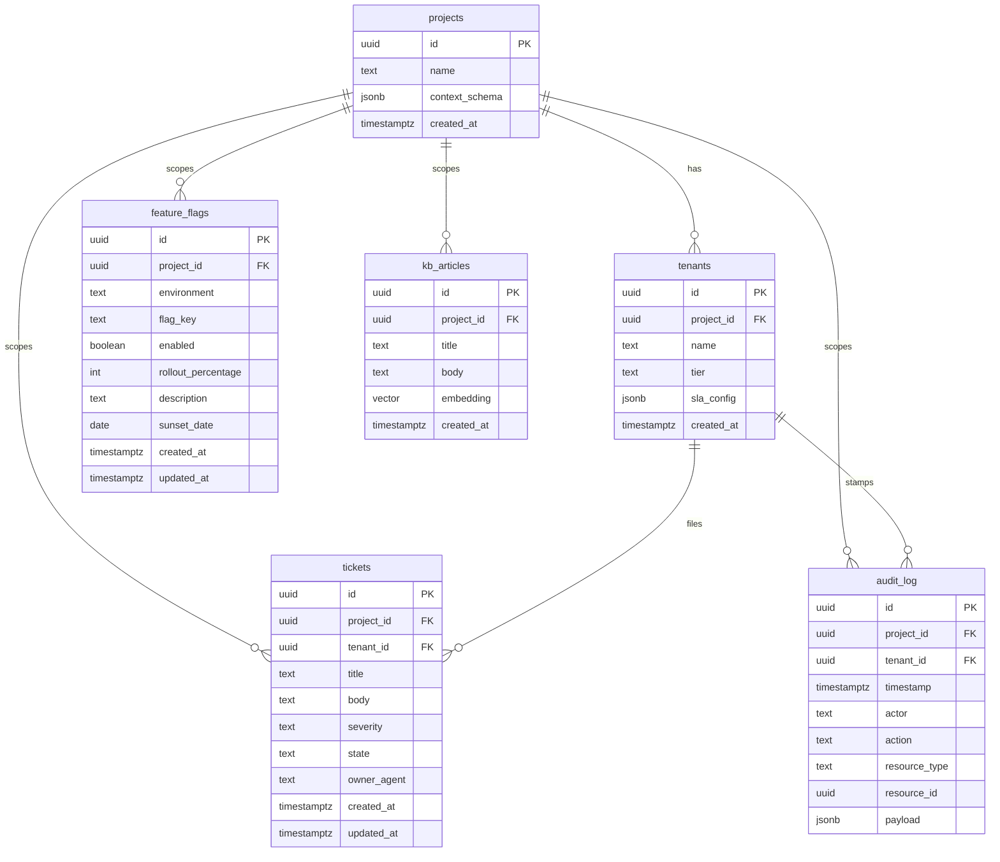

# Ops Hub — Supabase Schema Design (M1 / Sprint 1)

- **Status:** Proposed — pending Security Lead RLS/isolation sign-off (T-03)
- **Date:** 2026-06-18
- **Author:** Tech Lead
- **Reviewers required:** Security Lead (RLS + isolation), Data Engineer (vector / KB)
- **Related:** `04_architecture.md` (Tenant isolation, Audit trail), `docs/engineering/database-migrations.md`, `docs/engineering/feature-flags.md`, ADR-0001, ADR-0002
- **Migrations:** `supabase/migrations/20260618120000_initial_schema.sql`, `supabase/migrations/20260618120100_enable_rls_policies.sql`

---

## 1. Scope

The minimum Ops Hub platform schema to clear M1: six tables — `projects`, `tenants`, `tickets`, `audit_log`, `feature_flags`, `kb_articles` — with Row-Level Security (RLS) enforcing tenant isolation on every table that carries `tenant_id`, plus append-only enforcement on `audit_log`.

All six are **Ops Hub platform tables**, not project-specific tables. This matters for two policies in `database-migrations.md`:
- **"Cross-project foreign keys prohibited"** applies to FKs from *one project's data tables to another project's*. It does **not** prohibit FKs *among platform tables*. `tenants.project_id → projects.id`, `tickets.project_id → projects.id`, etc. are intended and fine — they are the platform's own relational graph.
- **Per-project migration subdirectories** (`supabase/migrations/ops_hub/`, `.../tts/`) in `database-migrations.md` describe the *future* layout once project-specific schema lands. For M1, all tables are platform tables, so migrations live as **flat, timestamped files** directly in `supabase/migrations/` — which is what the Supabase CLI applies natively and what the T-03 brief specifies. We revisit per-project subdivision when TTS/Project-2 schema is added (will need a short ADR). **Flagged discrepancy:** `database-migrations.md` should be updated to note the flat layout for platform migrations.

---

## 2. THE load-bearing decision: how "current tenant" is identified (read this first)

RLS only isolates if we are explicit about **which database principal it applies to.** This is the single most important thing for the Security Lead to confirm, because a plausible-looking policy can guarantee nothing on the paths that matter.

### The Supabase service_role bypass

**Supabase's `service_role` key bypasses RLS entirely.** Any code that connects with the service-role key sees every row regardless of policy. Backend automation — our agents and Inngest workflows — defaults to using the service-role key. So if agents hit the DB as `service_role`, **RLS provides zero isolation on the agent paths**, which are most of our paths in Phase 1.

We therefore split enforcement by access path and state the mechanism for each:

| Access path | Connects as | Is RLS the boundary? | How isolation is enforced |
|---|---|---|---|
| **Tenant-facing portal** (Phase 2 frontend, BYOK portal Phase 3) | `authenticated` (Supabase Auth, anon/JWT) | **Yes — RLS is the real boundary** | Policy reads `tenant_id` from the JWT claim: `(auth.jwt() ->> 'tenant_id')::uuid` |
| **Agent / Inngest workflow paths** (Phase 1, most traffic) | dedicated app role (see below), **not** `service_role` | **Yes**, via session-set tenant context | Policy reads `current_setting('app.current_tenant', true)::uuid`; the app sets it per request/step |
| **Platform admin / migrations** | `service_role` / `postgres` | No (bypasses by design) | Trusted path; isolation enforced by code review + audit_log; used only for migrations and cross-tenant platform operations |

### Decision (T-03)

1. **Agents and workflows do NOT use the `service_role` key for tenant-scoped data access.** They connect via a dedicated, **non-superuser** application role (proposed name: `ops_hub_app`) that does **not** bypass RLS. Before any tenant-scoped query, the app sets the session tenant via a `SET` / `set_config('app.current_tenant', <tenant_id>, true)` (transaction-scoped). RLS policies read that GUC. **Security Lead to confirm** the role + GUC approach vs. the JWT-only approach; the GUC path is what makes RLS meaningful for non-Auth (agent) traffic.
2. **`service_role` is reserved for** migrations and explicitly cross-tenant platform operations (e.g., the platform writing an `audit_log` entry that spans tenants, or seeding `projects`). Every service-role data write is itself audit-logged.
3. **Default-deny / fail-closed everywhere.** RLS is enabled on all six tables. A table with RLS on and no permissive policy returns zero rows — that is the desired floor. We never leave a table RLS-off in a multi-tenant DB, and policies never include a "no context set ⇒ allow all" branch (a forgotten `set_config` must yield zero rows, not full exposure). Platform-wide enumeration is done via `service_role` (which bypasses RLS), so the policies never need a permissive fallback.

> **Expression note:** the policies resolve the tenant via `current_setting('request.jwt.claims', true)::jsonb ->> 'tenant_id'`. Supabase's `auth.jwt() ->> 'tenant_id'` is sugar for exactly that — the two are equivalent; the migration uses the explicit `current_setting` form so the same function also reads the `app.current_tenant` GUC for non-Auth (agent) traffic.

> **Open question for Security Lead (not founder-owned):** do we want a hard guarantee that `service_role` is *never* used from agent code (e.g., the agents simply do not hold that key — only the Model Router service / migration runner does)? My recommendation is yes: scope the service-role key to the migration runner and a single trusted platform service, and give agents only the `ops_hub_app` role credential. This makes the bypass unreachable from agent code rather than merely discouraged. Confirm this matches the threat model.

This is the headline item for review. Everything below assumes this model.

---

## 3. Entity model

**Isolation tiers across the tables:**
- **Project-scoped only** (no tenant dimension): `projects`, `feature_flags`, `kb_articles`. These belong to a project but not to a single tenant. RLS isolates by `project_id`.
- **Tenant-scoped**: `tenants`, `tickets`, `audit_log`. These carry `tenant_id` and are isolated by tenant.

---

## 4. Table definitions

### 4.1 `projects` — platform registry (Module A mirror)

The runtime mirror of the per-project config (`projects/<name>/config.json` in git, per `04_architecture.md` Module A). `context_schema jsonb` holds the Project Context bundle for runtime queries.

| Column | Type | Notes |
|---|---|---|
| `id` | uuid PK | `gen_random_uuid()` |
| `name` | text, unique, not null | slug, e.g. `tts` |
| `context_schema` | jsonb, not null, default `'{}'` | Project Context (Solutions Architect owns the shape via T-04) |
| `created_at` | timestamptz, default `now()` | |

Not tenant-scoped; readable by all project paths, writable by platform (`service_role`) only.

### 4.2 `tenants` — customers of a project

| Column | Type | Notes |
|---|---|---|
| `id` | uuid PK | |
| `project_id` | uuid FK → `projects(id)`, not null | |
| `name` | text, not null | e.g. `DNC` |
| `tier` | text, not null | `starter` / `growth` / `scale` (+ Premium add-on tracked in `sla_config`) |
| `sla_config` | jsonb, not null, default `'{}'` | severity→SLA targets, Premium flag |
| `created_at` | timestamptz, default `now()` | |

Tenant-scoped (a tenant can read its own row; the platform manages all rows).

### 4.3 `tickets` — system of record for tickets

FreeScout is *intake*; this table is the system of record (per ADR-0002 §6).

| Column | Type | Notes |
|---|---|---|
| `id` | uuid PK | |
| `project_id` | uuid FK → `projects(id)`, not null | |
| `tenant_id` | uuid FK → `tenants(id)`, not null | |
| `title` | text, not null | |
| `body` | text | treated as **untrusted tenant input** (prompt-injection surface, `04_architecture.md` Concern 4) |
| `severity` | text, not null | `P1` / `P2` / `P3` (CHECK constraint) |
| `state` | text, not null, default `'new'` | lifecycle state (CHECK against the 14-state set; M1 uses `new`→`closed` + `won't_fix`,`duplicate`) |
| `owner_agent` | text | which agent currently owns it |
| `created_at` | timestamptz, default `now()` | |
| `updated_at` | timestamptz, default `now()` | maintained by trigger |

Indexes: `(project_id, tenant_id)`, `(state)`, `(severity)`.

### 4.4 `audit_log` — append-only audit trail

`04_architecture.md` requires "tenant ID stamped on every entry" and "append-only enforcement at the RLS level." The T-03 column list omitted `tenant_id`/`project_id`; **added here** to satisfy the architecture doc.

| Column | Type | Notes |
|---|---|---|
| `id` | uuid PK | |
| `project_id` | uuid FK → `projects(id)` | nullable (some platform-level events predate/transcend a project) |
| `tenant_id` | uuid FK → `tenants(id)` | nullable (platform-level events may have no tenant) |
| `timestamp` | timestamptz, not null, default `now()` | |
| `actor` | text, not null | which agent / `service_role` / user |
| `action` | text, not null | e.g. `ticket.state_change` |
| `resource_type` | text, not null | e.g. `ticket` |
| `resource_id` | uuid | the affected row |
| `payload` | jsonb, not null, default `'{}'` | before/after, context |

**Append-only:** RLS permits `INSERT` only. No `UPDATE`, no `DELETE` policy is granted to any non-superuser role → updates/deletes are denied. (Superuser/`service_role` can still technically modify; we accept that for the trusted migration path and note it as a residual to harden later, e.g. with a `BEFORE UPDATE/DELETE` trigger that raises.) Index: `(project_id, tenant_id, timestamp)`, `(resource_type, resource_id)`.

### 4.5 `feature_flags` — simple flag table (per `feature-flags.md`)

I keep the **richer locked schema** from `docs/engineering/feature-flags.md` rather than regress to the 4-column T-03 sketch. The one deliberate change: `project text` → **`project_id uuid FK → projects(id)`**, now that a `projects` table exists. This keeps referential integrity and matches the rest of the schema.

| Column | Type | Notes |
|---|---|---|
| `id` | uuid PK | |
| `project_id` | uuid FK → `projects(id)`, not null | (was `project text`) |
| `environment` | text, not null | `dev` / `staging` / `prod` |
| `flag_key` | text, not null | e.g. `enable_byok_tenant` |
| `enabled` | boolean, not null, default `false` | |
| `rollout_percentage` | int, not null, default `0` | 0–100 (CHECK) |
| `description` | text | required by flag discipline |
| `sunset_date` | date | required for temp flags |
| `created_at` | timestamptz, default `now()` | |
| `updated_at` | timestamptz, default `now()` | |
| | | `unique (project_id, environment, flag_key)` |

**Flagged discrepancy:** `feature-flags.md`'s schema block and its `isFeatureEnabled` helper (`.eq('project', …)`) reference `project` as text. Those must be reconciled to `project_id` when the helper is implemented. Noted for the implementer; tracked as a follow-up, not blocking M1.

### 4.6 `kb_articles` — KB / vector store (Concern 5)

| Column | Type | Notes |
|---|---|---|
| `id` | uuid PK | |
| `project_id` | uuid FK → `projects(id)`, not null | the per-project vector namespace (no cross-project leak) |
| `title` | text, not null | |
| `body` | text, not null | |
| `embedding` | `vector(1536)` | pgvector; 1536 dims (OpenAI `text-embedding-3-small` / ada-002 compatible). **Note:** dimension is embedding-model-specific — if the Model Router's default embedding model changes dims, this needs a migration. Flagged for Data Engineer. |
| `created_at` | timestamptz, default `now()` | |

Index: ivfflat / hnsw on `embedding` for ANN search (added once enough rows exist; on an empty table an ANN index is pointless — Data Engineer adds it during T-20 KB init). `project_id` filter applied **before** the vector query (per `04_architecture.md` — filter by project/tenant before RAG).

---

## 5. RLS policy summary

Full SQL in `20260618120100_enable_rls_policies.sql`. Summary of intent:

| Table | RLS | Policy intent |
|---|---|---|
| `projects` | enabled | SELECT where `id = current project` (fail-closed); INSERT/UPDATE/DELETE service_role only |
| `tenants` | enabled | a tenant sees only its own row (`id = current tenant`); platform manages all |
| `tickets` | enabled | rows where `tenant_id = current tenant`; default-deny otherwise |
| `audit_log` | enabled | **INSERT only** for app role (append-only); SELECT scoped to current tenant; no UPDATE/DELETE |
| `feature_flags` | enabled | SELECT where `project_id` in caller's project scope; writes per `feature-flags.md` authority table |
| `kb_articles` | enabled | SELECT where `project_id` in caller's project scope |

"Current tenant" resolves via the dual mechanism in §2: JWT claim for portal traffic, `app.current_tenant` GUC for agent traffic. Both expressed in the policy `USING` clause as a coalesce of the two sources so one policy serves both paths.

---

## 6. Items explicitly flagged for Security Lead

1. **service_role bypass (§2)** — confirm the `ops_hub_app` non-superuser role + `app.current_tenant` GUC model, and confirm agents should not hold the service-role key at all. This is the make-or-break item.
2. **audit_log append-only** — RLS denies UPDATE/DELETE for app roles, but `service_role`/superuser can still modify. Acceptable for M1? Or harden now with a trigger that raises on UPDATE/DELETE regardless of role?
3. **Nullable `tenant_id`/`project_id` on `audit_log`** — needed for platform-level events with no tenant. Confirm this doesn't create a hole where a tenant-scoped event could be written with a null tenant and thus escape tenant-scoped SELECT.
4. **Cross-tenant SELECT on audit_log** — should a tenant ever read its own audit entries (support transparency), or is audit_log platform-internal only? Current design scopes SELECT to current tenant; confirm.
5. **T-18 dependency** — the automated cross-tenant isolation test (Security Lead owns T-18) should exercise: tenant A cannot read tenant B's `tickets`, `tenants`, `audit_log` via the *agent* (`ops_hub_app`) path, not just the Auth path.

---

## 7. Migration files

| File | Contents |
|---|---|
| `20260618120000_initial_schema.sql` | extensions (`vector`), all six tables, FKs, CHECK constraints, indexes, `updated_at` trigger |
| `20260618120100_enable_rls_policies.sql` | `ENABLE ROW LEVEL SECURITY` on all six + all policies + the `ops_hub_app` role grant pattern |

RLS is split into its own migration **on purpose** so the Security Lead reviews the isolation logic in isolation (per the migrations-policy intent that Security Lead reviews RLS changes). Both are forward-only; UTC-timestamped; applied by the Supabase CLI in filename order.
